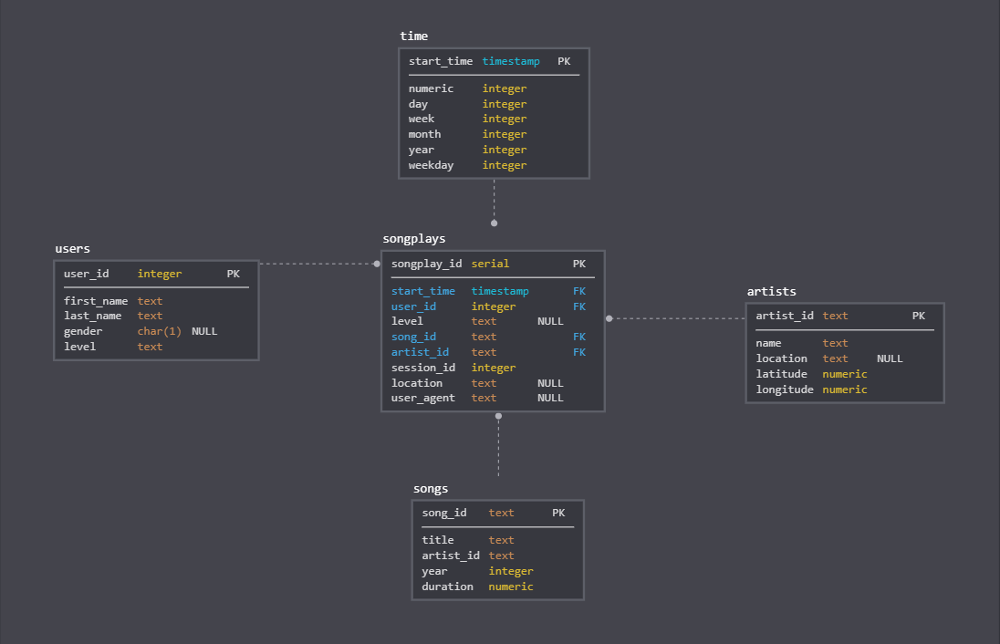

# Project 1: Data Modeling with Postgres

### Description
A startup called Sparkify wants to analyze the data they've been collecting on songs and user 
activity on their new music streaming app. The analytics team is particularly interested in 
understanding what songs users are listening to. 
They'd like to create a Postgres database with tables designed to optimize queries 
on song play analysis, and bring you on the project. I need to create a database schema and
ETL pipeline for this analysis. 

--------------------------------------------

#### Datasets

##### Song Dataset
Each file is in JSON format and contains metadata about a song and the artist of that song. 
The files are partitioned by the first three letters of each song's track ID. 
For example, here are filepaths to two files in this dataset.

Example:
```
{"num_songs": 1, "artist_id": "ARJIE2Y1187B994AB7", "artist_latitude": null, "artist_longitude": null, "artist_location": "", "artist_name": "Line Renaud", "song_id": "SOUPIRU12A6D4FA1E1", "title": "Der Kleine Dompfaff", "duration": 152.92036, "year": 0}
```

##### Log Dataset
The second dataset consists of log files in JSON format generated by this event simulator based on the songs in 
the dataset above. These simulate activity logs from a music streaming app based on specified configurations.

The log files in the dataset you'll be working with are partitioned by year and month. For example, here are filepaths
to two files in this dataset.
Example: 
```
{"artist":null,"auth":"Logged In","firstName":"Walter","gender":"M","itemInSession":0,"lastName":"Frye","length":null,"level":"free","location":"San Francisco-Oakland-Hayward, CA","method":"GET","page":"Home","registration":1540919166796.0,"sessionId":38,"song":null,"status":200,"ts":1541105830796,"userAgent":"\"Mozilla\/5.0 (Macintosh; Intel Mac OS X 10_9_4) AppleWebKit\/537.36 (KHTML, like Gecko) Chrome\/36.0.1985.143 Safari\/537.36\"","userId":"39"}
```

--------------------------------------------

#### Database schema

 

#### Fact Table
**songplays** - records in log data associated with song plays i.e. records with page NextSong
- songplay_id (serial PRIMARY KEY): ID of each user song play 
- start_time (timestamp NOT NULL): Timestamp of beggining of user activity
- user_id (integer NOT NULL): ID of user
- level (text): User level {free | paid}
- song_id (text NOT NULL): ID of Song played
- artist_id (text NOT NULL): ID of Artist of the song played
- session_id (integer): ID of the user Session 
- location (text): User location 
- user_agent (text): Agent used by user to access Sparkify platform

#### Dimension Tables
**users** - users in the app
- user_id (integer) PRIMARY KEY: ID of user
- first_name (text) NOT NULL: Name of user
- last_name (text) NOT NULL: Last Name of user
- gender (text): Gender of user {M | F}
- level (text): User level {free | paid}

**songs** - songs in music database
- song_id (text) PRIMARY KEY: ID of Song
- title (text) NOT NULL: Title of Song
- artist_id (text) NOT NULL: ID of song Artist
- year (integer): Year of song release
- duration (numeric) NOT NULL: Song duration in milliseconds

**artists** - artists in music database
- artist_id (text) PRIMARY KEY: ID of Artist
- name (text) NOT NULL: Name of Artist
- location (text): Name of Artist city
- lattitude (numeric): Lattitude location of artist
- longitude (numeric): Longitude location of artist

**time** - timestamps of records in songplays broken down into specific units
- start_time (timestamp) PRIMARY KEY: Timestamp of row
- hour (integer): Hour associated to start_time
- day (integer): Day associated to start_time
- week (integer): Week of year associated to start_time
- month (integer): Month associated to start_time 
- year (integer): Year associated to start_time
- weekday (integer): Name of week day associated to start_time

--------------------------------------------

