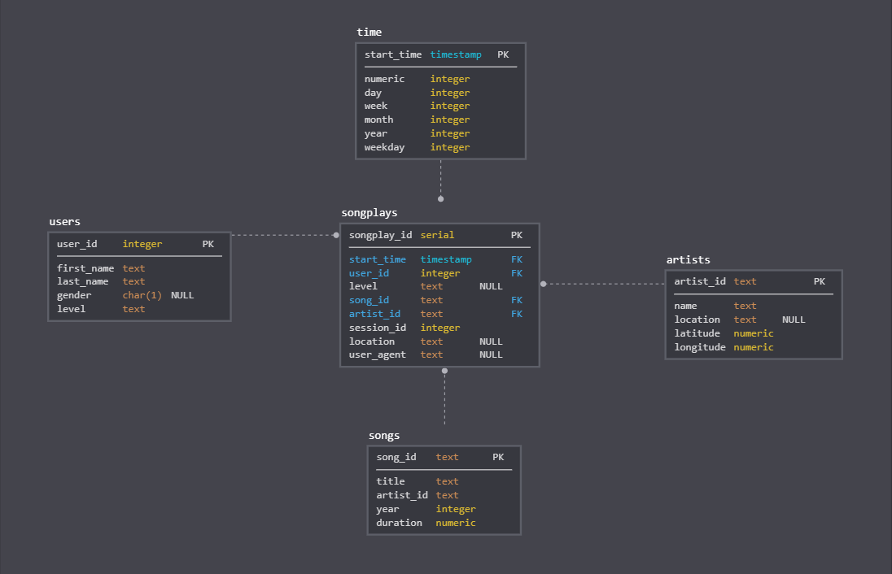

## Project 1: Data Modeling with Postgres

### Description
A startup called Sparkify wants to analyze the data they've been collecting on songs and user 
activity on their new music streaming app. The analytics team is particularly interested in 
understanding what songs users are listening to. 
They'd like to create a Postgres database with tables designed to optimize queries 
on song play analysis, and bring you on the project. I need to create a database schema and
ETL pipeline for this analysis. 

--------------------------------------------

### Datasets

#### Song Dataset
Each file is in JSON format and contains metadata about a song and the artist of that song. 
The files are partitioned by the first three letters of each song's track ID. 
For example, here are filepaths to two files in this dataset.

Example:
```
{"num_songs": 1, "artist_id": "ARJIE2Y1187B994AB7", "artist_latitude": null, "artist_longitude": null, "artist_location": "", "artist_name": "Line Renaud", "song_id": "SOUPIRU12A6D4FA1E1", "title": "Der Kleine Dompfaff", "duration": 152.92036, "year": 0}
```

#### Log Dataset
The second dataset consists of log files in JSON format generated by this event simulator based on the songs in 
the dataset above. These simulate activity logs from a music streaming app based on specified configurations.

The log files in the dataset you'll be working with are partitioned by year and month. For example, here are filepaths
to two files in this dataset.
Example: 
```
{"artist":null,"auth":"Logged In","firstName":"Walter","gender":"M","itemInSession":0,"lastName":"Frye","length":null,"level":"free","location":"San Francisco-Oakland-Hayward, CA","method":"GET","page":"Home","registration":1540919166796.0,"sessionId":38,"song":null,"status":200,"ts":1541105830796,"userAgent":"\"Mozilla\/5.0 (Macintosh; Intel Mac OS X 10_9_4) AppleWebKit\/537.36 (KHTML, like Gecko) Chrome\/36.0.1985.143 Safari\/537.36\"","userId":"39"}
```
--------------------------------------------

### Database schema

 

#### Fact Table
**songplays** - records in log data associated with song plays i.e. records with page NextSong
- songplay_id SERIAL PRIMARY KEY
- start_time TIMESTAMP NOT NULL REFERENCES time(start_time)
- user_id INTEGER NOT NULL REFERENCES users (user_id)
- level TEXT
- song_id TEXT REFERENCES songs (song_id)
- artist_id TEXT REFERENCES artists (artist_id)
- session_id INTEGER NOT NULL
- location TEXT
- user_agent TEXT

#### Dimension Tables
**users** - users in the app
- user_id INTEGER PRIMARY KEY
- first_name TEXT NOT NULL
- last_name TEXT NOT NULL
- gender CHAR(1)
- level TEXT NOT NULL

**songs** - songs in music database
- song_id TEXT PRIMARY KEY
- title TEXT NOT NULL
- artist_id TEXT NOT NULL
- year INTEGER NOT NULL
- duration NUMERIC NOT NULL

**artists** - artists in music database
- artist_id TEXT PRIMARY KEY
- name TEXT NOT NULL
- location TEXT
- latitude NUMERIC
- longitude NUMERIC

**time** - timestamps of records in songplays broken down into specific units
- start_time TIMESTAMP NOT NULL PRIMARY KEY
- hour INTEGER NOT NULL
- day INTEGER NOT NULL
- week INTEGER NOT NULL
- month INTEGER NOT NULL
- year INTEGER NOT NULL
- weekday INTEGER NOT NULL

--------------------------------------------
### Structure of project

The project includes folders and files:

*  /data   - source folder of the JSON files
  *  /log_data  - the folder with the wich dataset consists of log files in  JSON format generated by this event simulator based on the songs in the dataset above. These simulate activity logs from a music streaming app based on specified configurations.
  *  /song_data  -  the folder where the dataset is a subset of real data from the Million Song Dataset. Each file is in JSON format and contains metadata about a song and the artist of that song.
*  /img  - folder with an image of ER diagram of tables
*  etl.ipynb  - reads and processes a single file from song_data and log_data and loads the data into your tables. 
*  test.ipynb  - displays the first few rows of each table to let you check your database. Also you can test if tables are created and data are ingested correctly
*  create_tables.py  - drops and creates your tables. You run this file to reset your tables before each time you run your ETL scripts.
*  etl.py  - reads and processes files from song_data and log_data and loads them into your tables. 
*  sql_queries.py  - contains all your sql queries, and is imported into the last three files above.

--------------------------------------------
### How to Execute Code

- Run in console `python create_tables.py` or from `test.ipynb` notebook 
 ```
import create_tables as ct
ct.main()
```
That will execute DROP, CREATE and INSERT query statements from `sql_queries.py`.

- Create the blueprint of the pipeline to process and insert all data into the tables inside `etl.ipynb` notebook.
- Use what you've completed in `etl.ipynb` notebook to implement `etl.py`.  
- Run etl in console `python etl.py` or from `test.ipynb` notebook 
 ```
import etl
etl.main()
```
- Verify results with SQL queires from `test.ipynb` notebook. 

--------------------------------------------
### Example SQL Queries
This SQL query shows which gender listen to more music:

```
SELECT u.gender, count(s.songplay_id) FROM songplays as s JOIN users as u ON s.user_id=u.user_id GROUP BY u.gender
```

First, last name and gender who streams the most music:
```
SELECT first_name, last_name,gender FROM 
    (SELECT u.user_id,u.first_name, u.last_name,u.gender, count(s.songplay_id) as song_play_cnt 
    FROM songplays as s JOIN users as u ON s.user_id=u.user_id 
    GROUP BY u.user_id,u.first_name, u.last_name,u.gender) AS inner_q  
ORDER BY song_play_cnt DESC LIMIT 1; 
```
